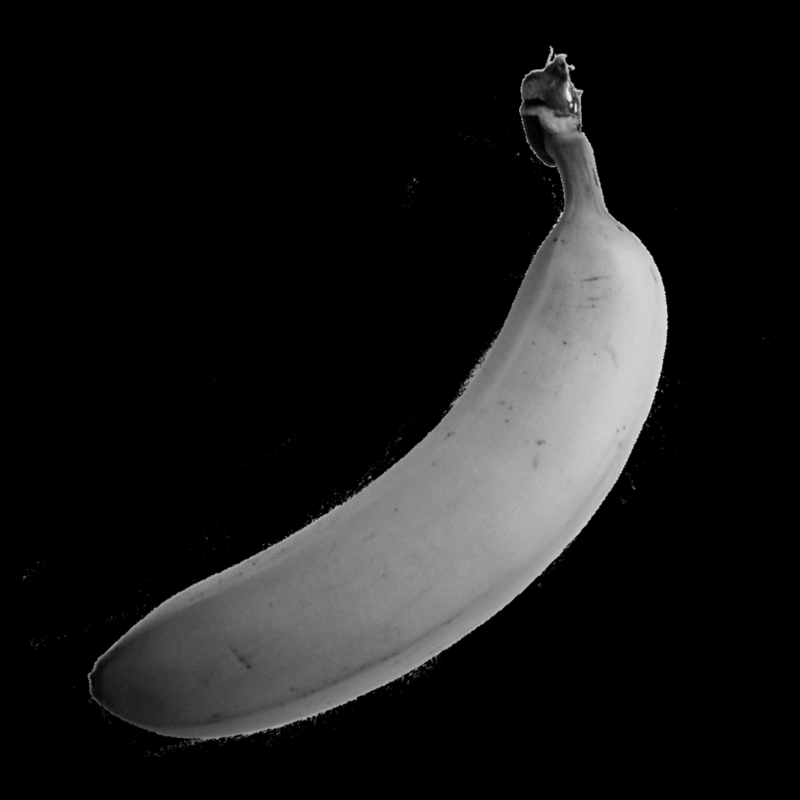
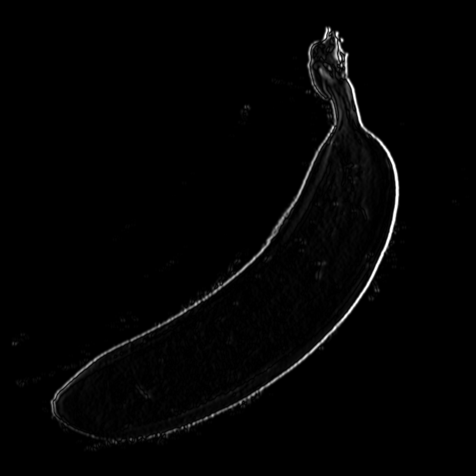
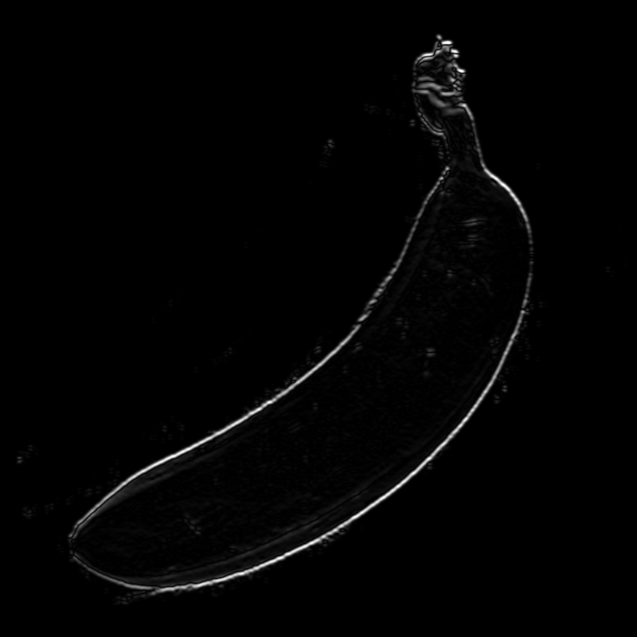
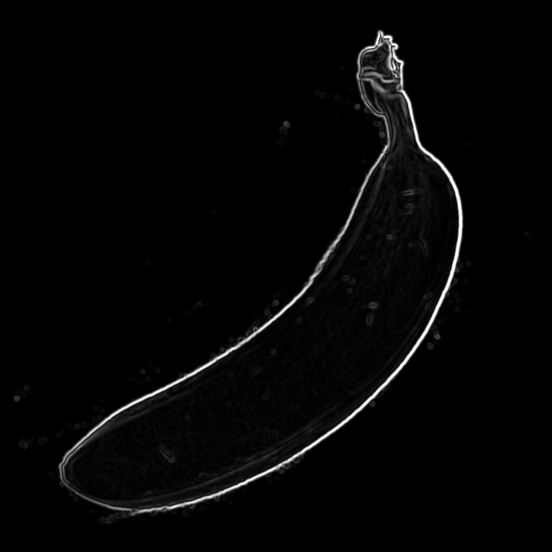
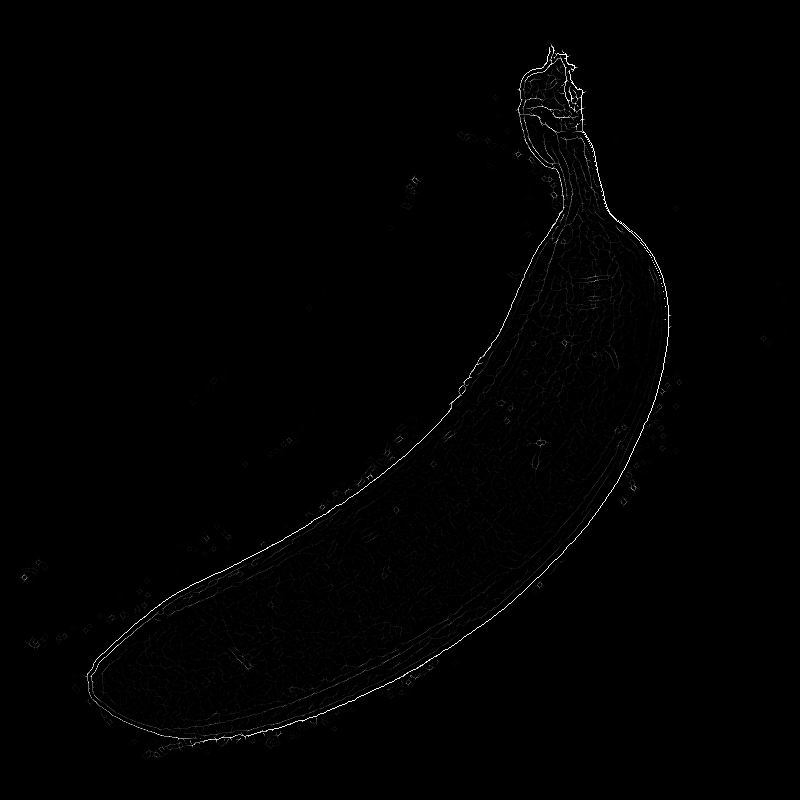
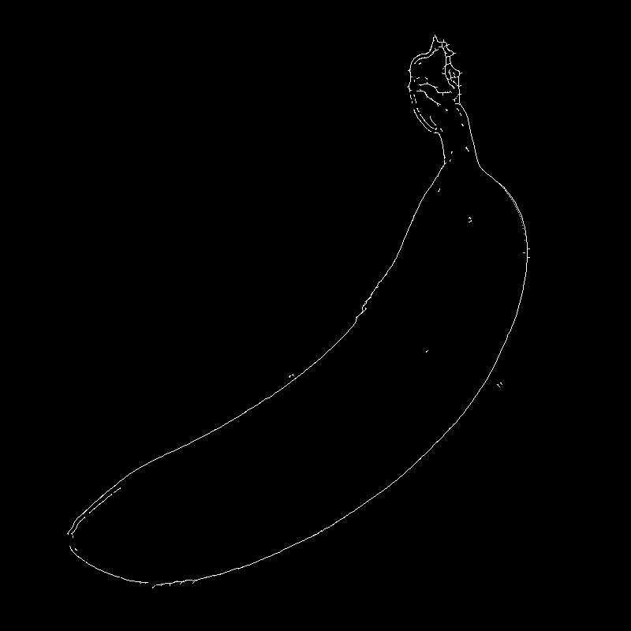

# Präfixsumme

Das Programm berechnet die Präfixsummen aller Elemente eines Inputsarrays.
Um es zu verwenden, das Repo clonen und den Ordner _PräfixSumme_ in Visual Studio öffnen. Um nun Präfixsummen zu brechenen kann man in Zeile 98 der Datei `PräfixSumme.cpp ` das Inputarray in Größe und Inhalt verändern, ind Zeile 128 kann entschieden werden, wie viel vom Ergebnisarray ausgegeben werden soll.. Ein simples ausführen des Debugger öffnet eine Kommandozeile die das gewünschte Ergebnis anzeigt.

# ImageFX Canny Kantenerkennung

Wie genau der Algorithmus arbeitet kann [hier](https://de.wikipedia.org/wiki/Canny-Algorithmus#Kantendetektion) nachgelesen werden.

## Setup
- Öffnen des ImageFX Ordners in Visual Studio (vorzugsweise VS 2019)
- Prüfen ob die OpenCL Libraries richting in der Projektkonfiguration verwiesen werden

Im Anschluss kann das Programm über den VS Debugger gestartet werden.

## Verwendung
Ist das Programm gestartet, gibt es drei Schalter die beschreibend bennant das tun was auf ihnen steht. 

Bei Druck auf _apply_ muss man darauf achten, dass in der Kommandozeile konfigurationen abgefragt werden, sobald diese eingegeben wurden startet die Berechnung.

Um ein anderes Bild zu wählen, muss man in Zeile 47 der `ImageFX.cpp` Datei auf dieses verweisen. Im _images_ Ordner liegen bereits einige Bilder zur verwenung bereit.

## Banane Beispiel

### Stage 0 Original

### Stage 1 Graustufen

### Stage 2 Gauss Blurr

### Stage 3 X-Sobel Filter 

### Stage 3 Y-Sobel Filter 

### Stage 4 Combination of both sobel filters: Asolute Edge Strengths

### Stage 5 Non maximum suppression

### Stage 6 hysterese

